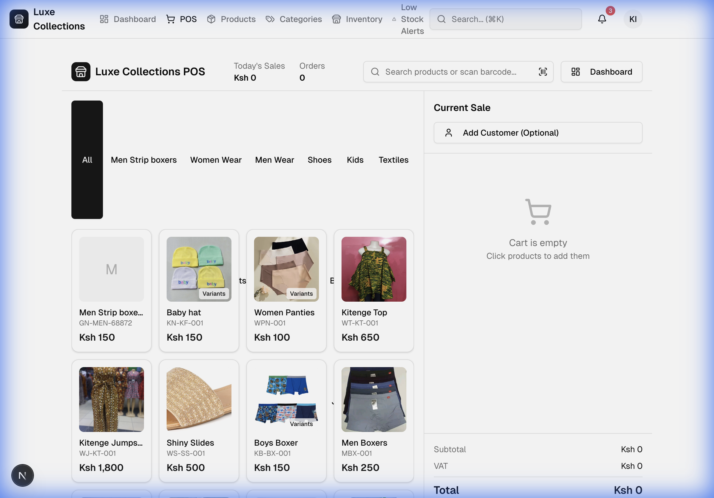
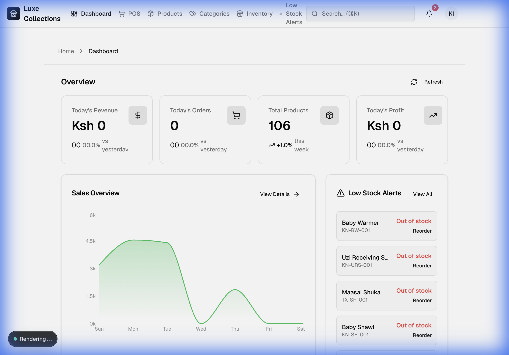
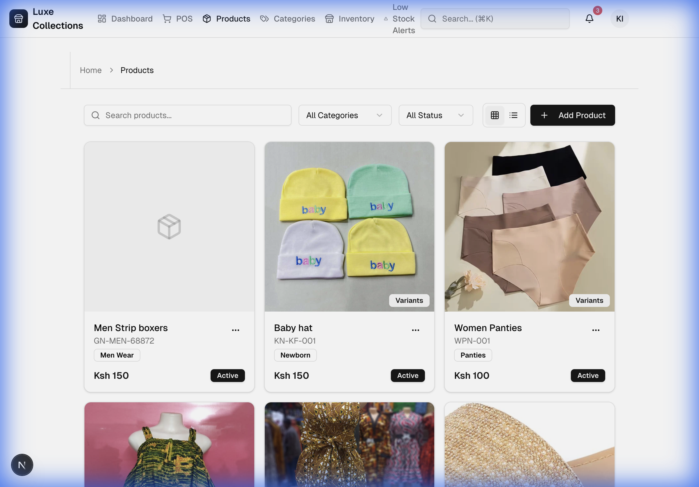
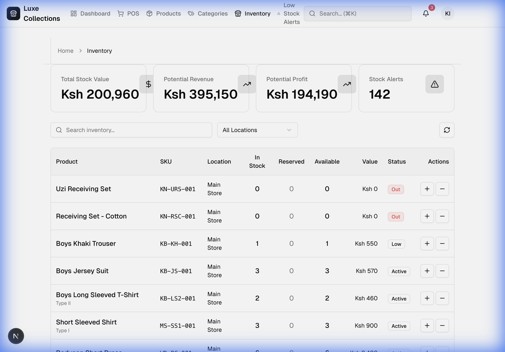
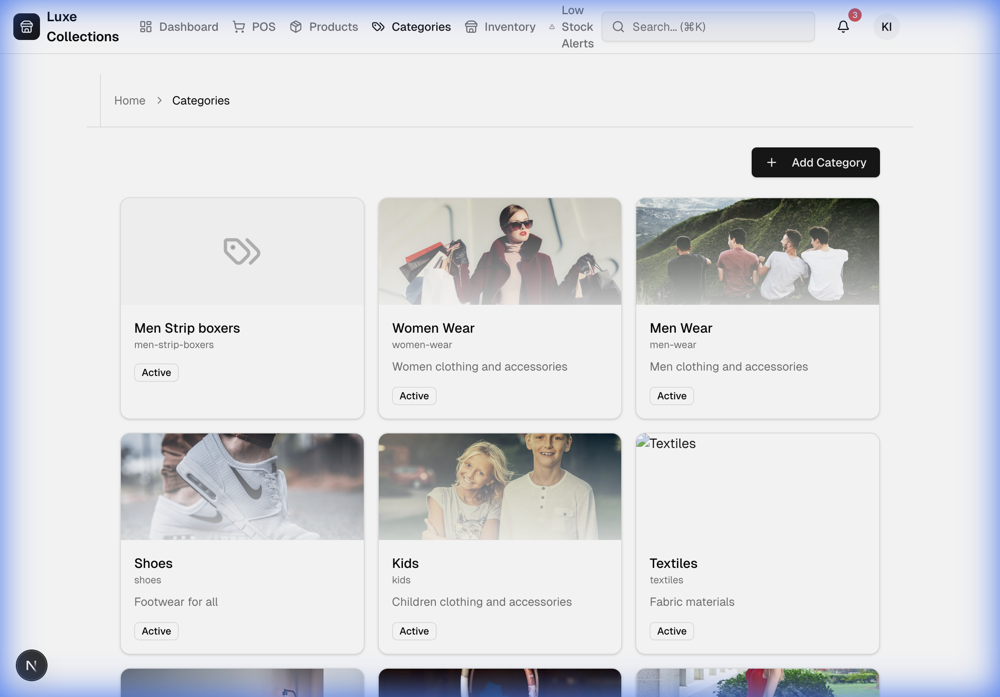

# Luxe Collections POS

A modern, full-featured Point of Sale (POS) system built for Luxe Collections - a Kenyan e-commerce platform specializing in authentic African fashion, baby essentials, luxury bedding, and premium perfumes.

## 🚀 Features

### 🏪 Point of Sale Interface
- **Quick Product Search**: Search products by name or scan barcodes for fast checkout
- **Category Filtering**: Browse products by category (Men Wear, Women Wear, Kids, Shoes, Textiles)
- **Visual Product Grid**: Product cards with images, prices, and SKUs
- **Real-time Cart Management**: Add/remove products with live subtotal, VAT, and total calculations
- **Customer Management**: Optional customer association with sales
- **Sales Tracking**: Track daily sales and order counts



### 📊 Dashboard & Analytics
- **Real-time Metrics**: Monitor today's revenue, orders, profit, and total products
- **Sales Overview Chart**: Visualize sales trends over time
- **Low Stock Alerts**: Get instant notifications for out-of-stock items
- **Product Count Tracking**: Weekly trend analysis for inventory levels



### 📦 Product Management
- **Grid/List Views**: Toggle between different product viewing modes
- **Advanced Search**: Search products by name, SKU, or description
- **Category & Status Filters**: Filter products by category and status (Active/Inactive)
- **Variant Support**: Manage product variants (sizes, colors, etc.)
- **Product Cards**: Rich product information with images, pricing, SKU, and status badges
- **Quick Actions**: Edit or manage products directly from the grid
- **Bulk Operations**: Add, edit, or delete products efficiently



### 📋 Inventory Management
- **Stock Value Tracking**: Monitor total stock value, potential revenue, and potential profit
- **Multi-location Support**: Track inventory across different locations (Main Store, etc.)
- **Stock Status Indicators**: Visual badges for Out of Stock, Low Stock, and Active items
- **Stock Adjustments**: Quick +/- buttons for manual stock updates
- **Reserved Stock Tracking**: Monitor reserved inventory vs. available stock
- **Stock Alerts**: Get notified when items need reordering (142 alerts shown in example)
- **Location-based Filtering**: Filter inventory by specific locations



### 🏷️ Category Management
- **Visual Category Cards**: Categories displayed with images, names, slugs, and descriptions
- **Category Search**: Quick search functionality to find specific categories
- **Status Management**: Activate or deactivate categories
- **Easy Creation**: Add new categories with the prominent "+ Add Category" button
- **Category Actions**: Edit or delete categories via action menus



### 🌍 E-commerce Landing Page
- **Kenyan-centric Branding**: Proudly displaying "Proudly Kenyan 🇰🇪" badge
- **Product Categories**: African Fashion, Baby Shop, Clothing, Bedding, Perfumes, Reviews
- **Hero Section**: Beautiful imagery showcasing "African Elegance Meets Modern Style"
- **Call-to-Action Buttons**: "Shop Now" and "Browse Collections" for easy navigation
- **User Authentication**: Secure login/logout functionality
- **Responsive Design**: Beautiful, modern interface optimized for all devices


## 🛠️ Technology Stack

- **Framework**: Next.js 14+ with App Router
- **Database**: Supabase (PostgreSQL)
- **Authentication**: Supabase Auth
- **Styling**: Tailwind CSS
- **Language**: TypeScript
- **UI Components**: Custom components with Radix UI primitives
- **State Management**: React Hooks and Server Components

## 📋 Prerequisites

- Node.js 18+ installed
- npm or yarn package manager
- Supabase account and project

## 🚀 Getting Started

### 1. Clone the Repository

```bash
git clone <repository-url>
cd supabase-pos
```

### 2. Install Dependencies

```bash
npm install
```

### 3. Set Up Environment Variables

Create a `.env.local` file in the root directory:

```env
NEXT_PUBLIC_SUPABASE_URL=your_supabase_url
NEXT_PUBLIC_SUPABASE_ANON_KEY=your_supabase_anon_key
```

### 4. Run Database Migrations

The database schema includes tables for:
- Products (with variants)
- Categories
- Inventory (multi-location stock tracking)
- Sales and Orders
- Customers
- Stock Movements

Migrations should be applied automatically via Supabase.

### 5. Start the Development Server

```bash
npm run dev
```

The application will be available at `http://localhost:3000`

## 📱 Application Routes

- `/` - E-commerce landing page
- `/dashboard` - Analytics dashboard
- `/pos` - Point of Sale interface
- `/products` - Product management
- `/categories` - Category management
- `/inventory` - Inventory tracking
- `/low-stock` - Low stock alerts

## 🔐 Authentication

The system uses Supabase Authentication with:
- Email/Password login
- Protected routes for admin/POS functionality
- Row-level security (RLS) policies

## 💾 Database Schema

### Key Tables:
- **products**: Product information, pricing, SKUs
- **product_variants**: Size, color, and other variant options
- **categories**: Product categories with slugs
- **inventory**: Multi-location stock tracking
- **sales**: Sales records with customer information
- **sale_items**: Individual items in each sale
- **customers**: Customer information
- **stock_movements**: Audit trail for inventory changes

## 🎨 Design Features

- Modern, clean UI with Tailwind CSS
- Responsive grid layouts
- Real-time data updates
- Visual status indicators
- Intuitive navigation
- Search and filter capabilities across all modules

## 📈 Future Enhancements

- [ ] Advanced reporting and analytics
- [ ] Multi-currency support
- [ ] Receipt printing
- [ ] Barcode generation
- [ ] Supplier management
- [ ] Purchase order tracking
- [ ] Employee/user role management
- [ ] Mobile app version

## 🤝 Contributing

Contributions are welcome! Please feel free to submit a Pull Request.

## 📄 License

This project is licensed under the MIT License.

## 👤 Author

Wycliff Kimutai - [kimtaiwiki@gmail.com](mailto:kimtaiwiki@gmail.com)

---

**Built with ❤️ for Kenyan businesses**
